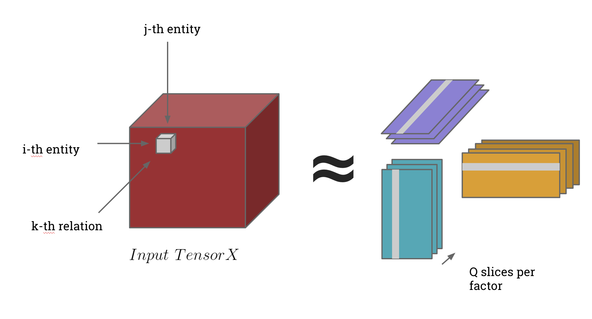

# NTFLib
Sparse Beta-Divergence Tensor Factorization Library

Based off of this [beta-NTF project](https://code.google.com/p/beta-ntf/) this library is 
specially-built to handle tensors where the sparsity implies missing data. Most
libraries are formulated around the handling of images which are dense or nearly
dense. However, we're interested in factorizing highly sparse (>99.9%) tensors
and have written NTFLib for this use case.

Currently, we only support rank-3 tensors, but extending to this to higher rank
tensors is fairly straightforward.

The algorithm implemented by beta_ntf features standard multiplicative updates
minimizing β-divergence, which were recently shown to guarantee a decrease of
the cost-function at each step. For recent references on the topic, check for
example:

- A. Cichocki, R. Zdunek, A. H. Phan, and S. Amari, Nonnegative matrix and tensor
factorizations : Applications to exploratory multi-way data analysis and blind
source separation, Wiley Publishing, September 2009.
- C. Févotte and J. Idier, Algorithms for nonnegative matrix factorization with
the beta-divergence, Neural Computation 23 (2011), no. 9, 2421–2456.
- Virtanen, Tuomas, Monaural Sound Source Separation by Perceptually Weighted
Non-Negative Matrix Factorization, Technical report, Tampere University of
Technology, Institute of Signal Processing, 2007.

